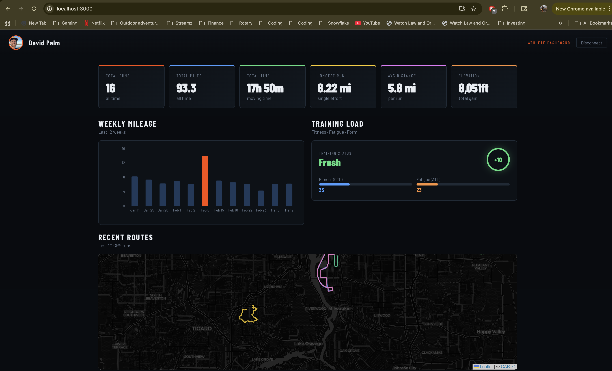

# 🏃 Strava Athlete Dashboard

A personal athlete analytics dashboard built with React that visualizes your Strava training data in real time.

🔗 **[Live Demo](https://strava-dashboard-dp.pages.dev)**



---

## Features

- 🔐 **Strava OAuth2** — Full authentication flow with automatic token refresh
- 📊 **Training Stats** — Total runs, miles, time, elevation, longest run, avg distance
- 📈 **Weekly Mileage Chart** — 12-week rolling bar chart with peak week highlighted
- 💪 **Training Load** — Fitness (CTL), Fatigue (ATL), and Form (TSB) scores
- 🗺️ **Route Map** — Last 10 GPS runs plotted on an interactive dark map
- 🏆 **Personal Records** — Best times for 5K, 10K, Half Marathon, and Marathon
- 🏃 **Recent Runs** — Latest activities with pace, distance, time, and elevation

---

## Tech Stack

| Layer | Tech |
|---|---|
| Frontend | React (Create React App) |
| Authentication | Strava OAuth2 with token refresh |
| Maps | Leaflet.js + React-Leaflet + CARTO dark tiles |
| Charts | Recharts |
| Deployment | Cloudflare Pages |

---

## Running Locally
```bash
git clone https://github.com/Dpalm88/strava-dashboard.git
cd strava-dashboard
npm install
```

Create a `.env` file:
```
REACT_APP_STRAVA_CLIENT_ID=your_client_id
REACT_APP_STRAVA_CLIENT_SECRET=your_client_secret
REACT_APP_REDIRECT_URI=http://localhost:3000/callback
```

Then:
```bash
npm start
```

---

## How It Works

1. User authenticates via Strava OAuth2
2. App fetches last 200 activities from Strava API
3. Training load calculated using CTL/ATL/TSB methodology
4. Routes decoded from Strava's encoded polyline format
5. All data visualized in a responsive dark dashboard

---

*Built by David Palm — ultrarunner & cloud infrastructure engineer*
